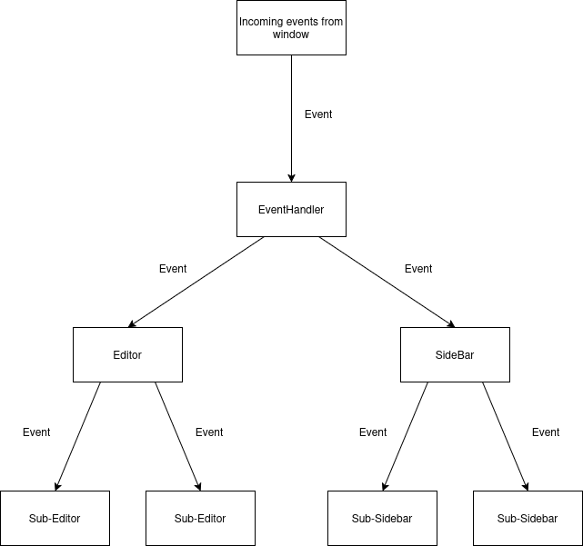

# Event Propagation



Events are filtered down from the window to editors and sidebars. The events are passed down to different sub-handlers based on the mode that editors are in.

`main.ts`
```typescript
window.addEventListener('keydown', (event) => handleKeyDown(event, editor, sidebar, menubar));
window.addEventListener('keyup', (event) => handleKeyUp(event, editor, sidebar, menubar));

editor.canvas.addEventListener('mousemove', (event) => handleMouseMove(event, editor));
editor.canvas.addEventListener('mouseout', (event) => handleMouseMove(event, editor));
editor.canvas.addEventListener('mouseleave', (event) => handleMouseMove(event, editor));
editor.canvas.addEventListener('mousedown', (event) => handleMouseClick(event, editor));
```

`EventHandlers.ts`
```typescript
export function handleKeyDown(event, editor: Editor, sidebar: Sidebar, menuBar: Menubar) {
    menuBar.handleKeyDown(event)
    sidebar.handleKeyDown(event)
    editor.handleKeyDown(event)
}
```